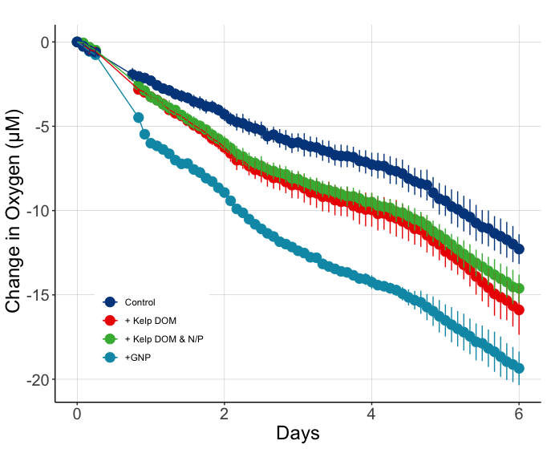

# Goal

This document shows how **individual bottle** bacterial abundance data from 2021 remineralization experiments were processed, QC'd and analyzed.  

Load packages that we'll need to analyze our data. 
```{r Load packages, message=FALSE, warning=FALSE}
library(tidyverse)
library(readxl)
library(lubridate)
```

# Import Data 

```{r}
excel_sheets("~/Desktop/144l_students_2021/Input_Data/week4/144L_2021_BactAbund.xlsx")

metadata <- read_excel("~/Desktop/144l_students_2021/Input_Data/week4/144L_2021_BactAbund.xlsx", sheet = "Metadata")

glimpse(metadata)

dapi_data <- read_excel("~/Desktop/144l_students_2021/Input_Data/week4/144L_2021_BactAbund.xlsx", sheet = "DAPI_Data")
glimpse(dapi_data)

dapi_metadata <- metadata %>%
  select(-Bottle) %>%
  unique()
glimpse(dapi_metadata)

joined <-  left_join(dapi_metadata, dapi_data) 

```

Complete: prepare data, plot growth curves for Cells_L and Cell Biovolume data AND identify exponential growth (same as previous assignment now with the new data). 


# Prepare Data

Convert the Date and Time column values from characters to dates, add columns with time elapsed for each treatment, and convert to cells/L because it will help us match up with the TOC data later. Also drop NA values.

```{r message=FALSE, warning=FALSE}
#insert your code here
DAPI_Data <- joined %>%
  mutate(Datetime = ymd_hm(Datetime), 
  Cells_L = as.numeric(Cells_mL) * 0.001,
  Cells_L_Stdev = as.numeric(Cells_mL_Stdev) * 0.001) %>%
  group_by(Treatment) %>%
  ungroup() %>%
  select(Experiment:Cells_L, Cells_L_Stdev, Treatment, Timepoint) %>%
  drop_na(Cells_L)
glimpse(DAPI_Data)
view(DAPI_Data)
```


# Plot Growth Curves

Plot growth curves for each treatment using DAPI cell abundance and biovolume data. 

## Cell Abundance Growth Curve

```{r message=FALSE, warning=FALSE}
#insert your code here

custom.colors <- c("Control" = "#377EB8", "Ash Leachate" = "#4DAF4A", "Mud Leachate" = "#E41A1C", "Glucose_Nitrate_Phosphate" = "#FF7F00", "Kelp Exudate_Nitrate_Phosphate" = "#00FF00", "Kelp Exudate" = "#DDA0DD")
levels <- c("Control", "Ash Leachate", "Mud Leachate", "Glucose_Nitrate_Phosphate", "Kelp Exudate_Nitrate_Phosphate", "Kelp Exudate")
DAPI_Data %>%
  mutate(DAPI_Data = ifelse(Cells_L == T, "*", NA)) %>%
  ggplot(aes(x=Timepoint, y=Cells_L, group = interaction(Treatment))) +
  geom_line(aes(color = factor(Treatment, levels = levels)), size =1) +
  geom_point(aes(fill = factor(Treatment, levels = levels)), size = 3, color = "black", shape = 21) + 
  labs(x = "Timepoint", y = expression(paste("Cells, L"^-1)), fill = "") + 
  guides(color = "none") + 
  scale_color_manual(values = custom.colors) +
  scale_fill_manual(values = custom.colors) +
  #facet_grid(rows = "Treatment")
  theme_bw()
```

Q: What differences between the treatments do you observe? Does this make sense in the context of the oxygen drawdown data (pictured below)?

A: For Cell abundance, Glucose Nitrate Phosphate > Kelp Exudate Nitrate Phosphate > Kelp Exudate > Control, which means the more nutrients added in the treatment, the greater bacteria growth efficiency would be. All curve except the control one become smoother after timepoint 4. A possible reason might be the nutrients added were running out. Also, as the cell abundance increases, they would consume more oxygen. The graph we get is mostly supported by the change in oxygen data. The only difference is kelp DOM and N/P treatment and Kelp DOM treatment are reversed. The two lines in oxygen are very close to eanch other, and maybe some other factors leading to this situation.

Oxygen Drawdown: 



## Cell Biovolume Growth Curve

```{r message=FALSE, warning=FALSE}
#insert your code here
custom.colors <- c("Control" = "#377EB8", "Ash Leachate" = "#4DAF4A", "Mud Leachate" = "#E41A1C", "Glucose_Nitrate_Phosphate" = "#FF7F00", "Kelp Exudate_Nitrate_Phosphate" = "#00FF00", "Kelp Exudate" = "#DDA0DD")
levels <- c("Control", "Ash Leachate", "Mud Leachate", "Glucose_Nitrate_Phosphate", "Kelp Exudate_Nitrate_Phosphate", "Kelp Exudate")
DAPI_Data %>%
  mutate(DAPI_Data = ifelse(Mean_Biovolume_um3_cell == T, "*", NA)) %>%
  ggplot(aes(x=Timepoint, y=Mean_Biovolume_um3_cell, group = interaction(Treatment))) +
  geom_line(aes(color = factor(Treatment, levels = levels)), size =1) +
  geom_point(aes(fill = factor(Treatment, levels = levels)), size = 3, color = "black", shape = 21) + 
  labs(x = "Timepoint", y = expression(paste("Biovolume, um"^3)), fill = "") + 
  guides(color = "none") + 
  scale_color_manual(values = custom.colors) +
  scale_fill_manual(values = custom.colors) +
  #facet_grid(rows = "Treatment")
  theme_bw()
```

Q: What differences do you notice between the cell abundance data and the cell biovolume data? 

A: Biovolume decreased after timepoint 4 for each group. Also, Kelp exudate nitrate phosphate can be higher in biovolume than glucose nitrate phosphate at most of the time. The Kelp Exudate treatment's biocolume could even drop into a lower point than the control group at timepoint 8.
